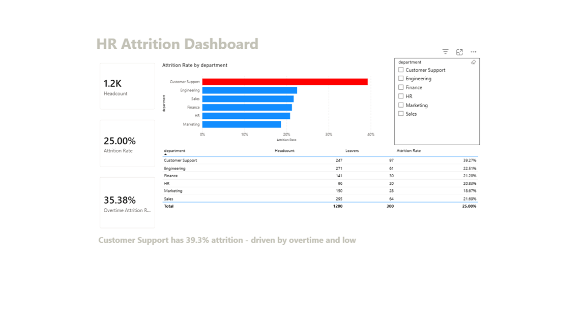
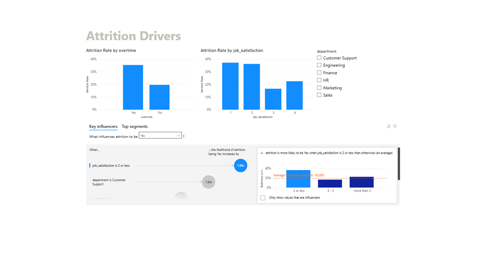

# Project 2: Employee Attrition Analysis

**Pipeline: Excel (raw + cleaning) -> SQL (analysis) -> Power BI (dashboard)**

## Business question
Which employees are most likely to leave, and what's actually driving it?

## Stage 1 - Excel: raw data + cleaning
Open `HR_Attrition_Analysis.xlsx`:
- **Tab "1. Raw Data"** - the untouched HR export (1,200 employees). Two known
  issues, highlighted in yellow: some blank `monthly_income` cells, and
  `overtime` typed inconsistently ("Yes"/"yes"/"No"/"no").
- **Tab "2. Cleaned Data"** - every cell is a formula that reads from Raw Data
  and fixes it:
  - `overtime` -> `=PROPER('1. Raw Data'!H2)` fixes the casing
  - `monthly_income` -> `=IF('1. Raw Data'!G2="", ROUND(AVERAGEIFS(...),2), '1. Raw Data'!G2)`
    fills blanks with the average income for that department + job level
  - Every other column is passed through unchanged
  - Change a value in Raw Data and this tab updates automatically - that's
    the point of doing it with formulas instead of manually editing values
- **Tab "3. Attrition Summary"** - COUNTIFS/AVERAGEIF formulas pull from
  "2. Cleaned Data" to compute attrition rate by department, overtime,
  satisfaction, and work-life balance
- **Tab "4. Insights"** - the plain-English write-up

## Stage 2 - SQL: analysis
`fact_employees_clean.csv` is the Cleaned Data tab exported to CSV - load
this into any SQL tool (or SQLite/MySQL/PostgreSQL) as a table named
`employees_clean`, then run:
- `sql/01_attrition_by_department.sql` - ranks departments by attrition rate (`RANK()`)
- `sql/02_attrition_drivers.sql` - tests overtime, satisfaction, and work-life
  balance as drivers, plus a combined Customer Support breakdown

These SQL scripts do NOT touch cleaning - that already happened in Excel.
They only answer analytical questions on data that's already trustworthy.

## Stage 3 - Power BI: the dashboard
`HR_Attrition_Dashboard.pbix` - built from `fact_employees_clean.csv`, two pages:

**DAX measures used:**
```
Headcount = COUNTROWS(fact_employees_clean)
Leavers = CALCULATE([Headcount], fact_employees_clean[attrition] = "Yes")
Attrition Rate = DIVIDE([Leavers], [Headcount])
Overtime Attrition Rate = CALCULATE([Attrition Rate], fact_employees_clean[overtime] = "Yes")
```

**Page 1 - Overview**

KPI cards (Headcount, Attrition Rate, Overtime Attrition Rate), attrition rate
by department (Customer Support flagged in red), a detail table, and a
department slicer.

**Page 2 - Drivers**

Attrition rate by overtime and by job satisfaction, plus Power BI's **Key
Influencers** visual - which statistically ranks what actually drives
attrition rather than assuming: `job_satisfaction is 2 or less` increases
the likelihood of attrition by **1.90x**, and `department is Customer
Support` increases it by **1.84x**.

## The insight (your "so what")
- **Customer Support has 39.3% attrition** - nearly double every other department
- **Overtime is the single strongest driver**: 35.4% attrition if working
  overtime, vs. 19.7% if not
- **Low job satisfaction (score 1-2) roughly doubles attrition** (37% vs ~19%)
- Inside Customer Support specifically, employees who are **both on overtime
  and report low satisfaction leave at 47.7%** - the highest-risk segment
  in the company

**Takeaway:** attrition isn't evenly spread - it's concentrated in one
department and strongly tied to overtime. A retention program that targets
"everyone" wastes budget; targeting Customer Support overtime workers first
would address the biggest chunk of turnover.

CV summary

Cleaned 1,200 employee records in Excel, analyzed attrition drivers in SQL, and built a Power BI dashboard. Found that overtime nearly doubles attrition risk, and pinpointed Customer Support employees on overtime as the highest-risk group (47.7% attrition) - the top priority for retention efforts.
